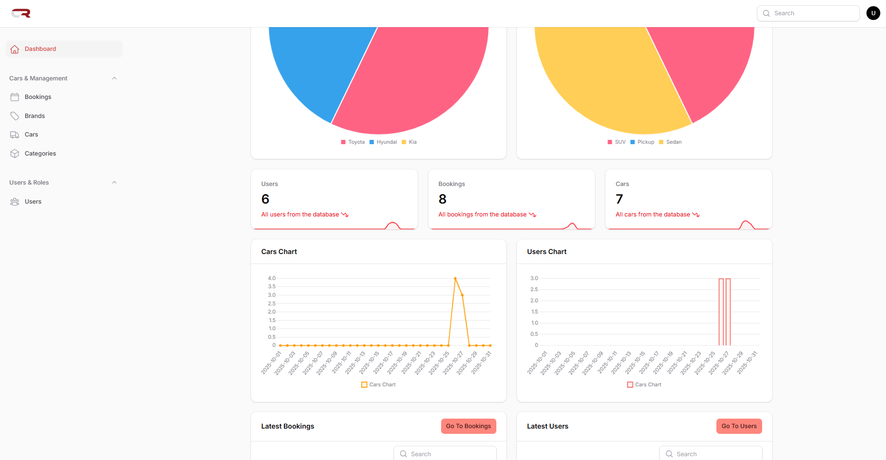
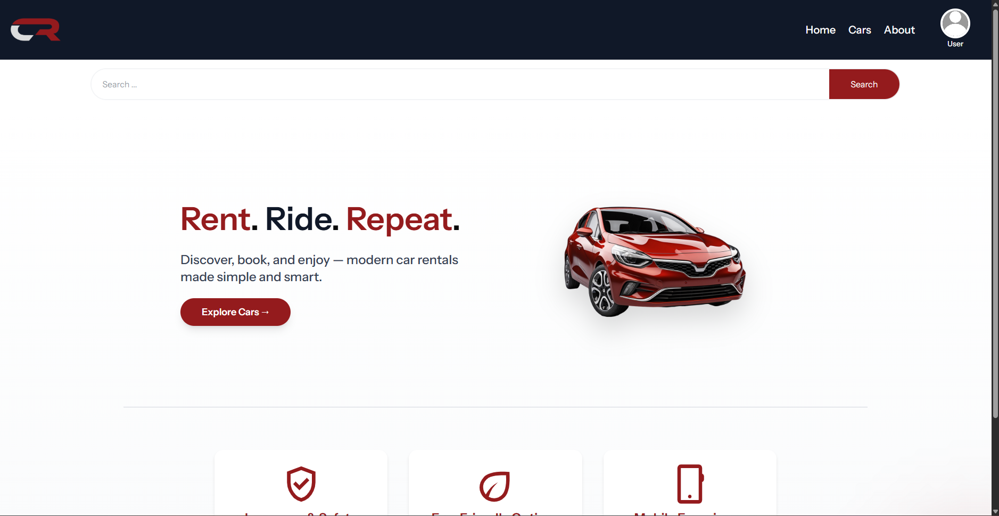
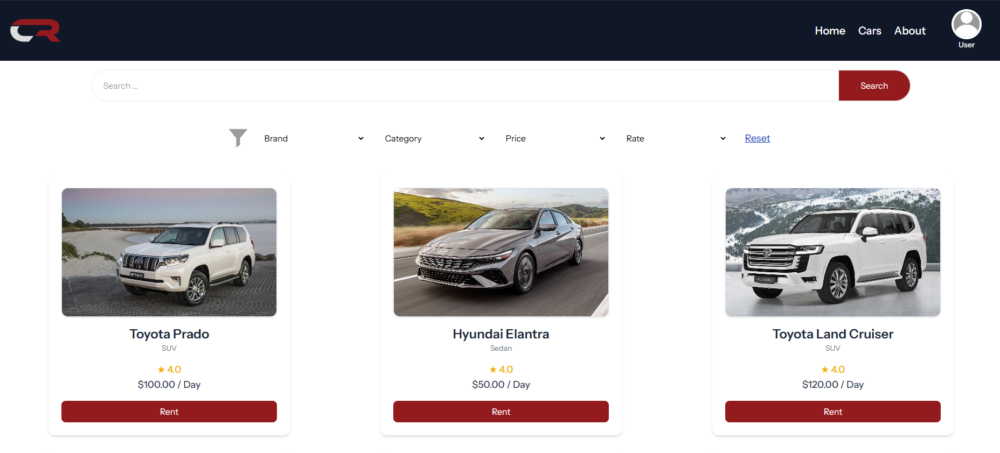
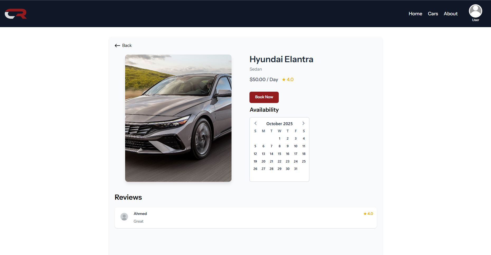
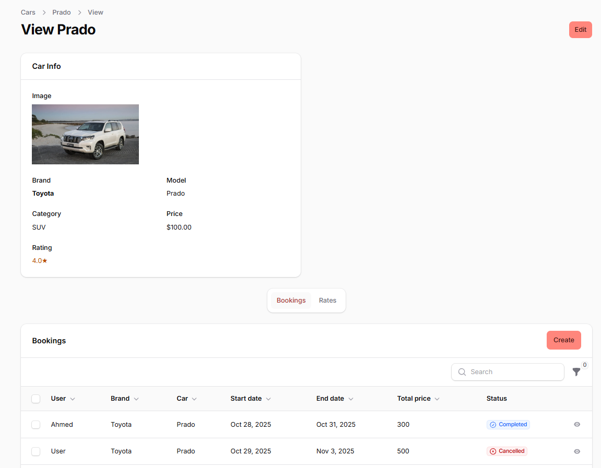
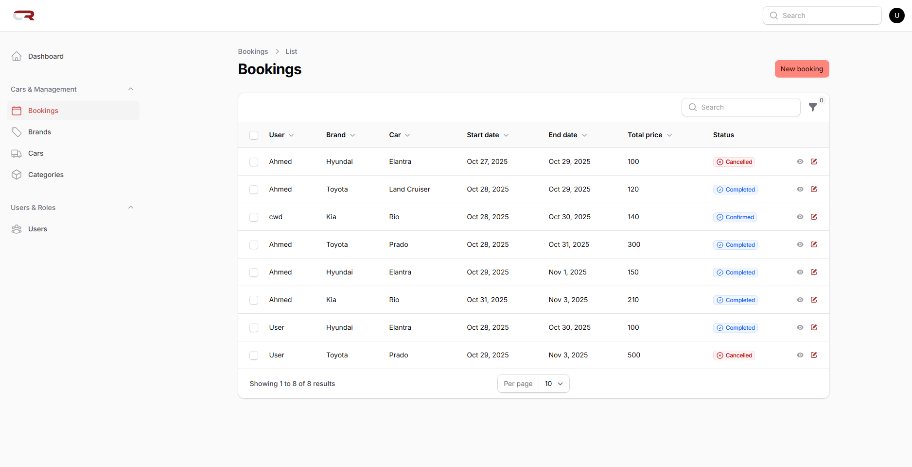
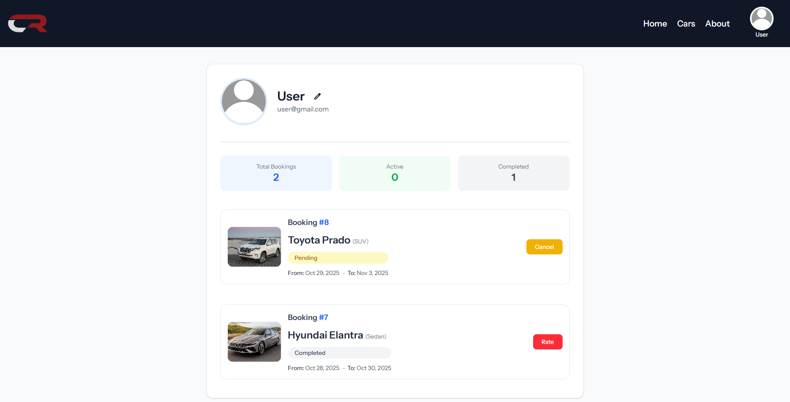

# Car Renting Project

A full-featured Car Renting Web Application built with Laravel, Vue.js, and FilamentPHP.
It provides an admin panel, real-time data visualization, and a modern user experience for managing cars, bookings, and customers.

---

Features:

- Filament Admin Dashboard for managing cars, bookings, and users
- Car availability management with date-based filtering
- Automatic price calculation based on rental duration
- Dynamic charts and analytics for admin insights
- Authentication system (admin & user roles)
- Responsive design powered by TailwindCSS
- RESTful API integration with Vue frontend

---

Tech Stack:

Layer          | Technology
---------------|-------------
Backend        | Laravel 11
Frontend       | Vue 3
Admin Panel    | FilamentPHP 3
Database       | MySQL
Styling        | TailwindCSS
Auth           | Laravel Breeze / Sanctum
Charts         | ApexCharts

---

Quick Start:

1. Clone the repository:
   git clone https://github.com/your-username/Car-Renting-Project.git
   cd Car-Renting-Project

2. Install backend dependencies:
   composer install

3. Install frontend dependencies:
   npm install

4. Copy environment file and generate app key:
   cp .env.example .env
   php artisan key:generate

5. Run migrations and seeders:
   php artisan migrate --seed

6. Start development servers:
   php artisan serve
   npm run dev

Then open your browser at http://localhost:8000

Note: This project may include licensed tools such as Filament or Nova, which are not included in this repository. Please install them with your own license if needed.

---

Screenshots (located in public/screenshots):

Dashboard       | Home Page
----------------|----------------
 | 

Cars Page       | Car Show
----------------|----------------
 | 

Car View        | Bookings Table
----------------|----------------
 | 

Profile Page
------------

---
---

---

Contributing:

Pull requests are welcome. For major changes, please open an issue first to discuss.

---

License:

This project is open-source and available under the MIT License.

---

Contact:

Author: Ahmed Al-Hemyari (https://github.com/Ahmed-Al-Hemyari)
Email: your.email@example.com

---

Built with Laravel, Vue, and Filament.
